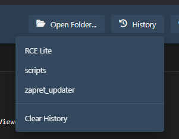
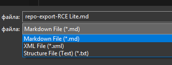

# Repo Console Lite

Repo Console Lite is a desktop application for browsing local repository structures, viewing and editing files, and exporting project contents in various formats. It aims to provide a simple interface for quickly understanding and documenting codebases.

## Features

*   **Local Repository Structure Viewer**: Interactive tree-style display of files and folders for local projects.
*   **File Content Viewing**: View text-based files within the application.
*   **Syntax Highlighting**: Supports highlighting for numerous programming languages using Highlight.js.
*   **Basic File Editing**: Edit text files directly within the app (enable by double-clicking a file). Save changes with `Ctrl+S` or the "Save" button, discard with `Esc`.
*   **Multi-Format Project Export**: Export local project contents (filtered by extension and ignoring specified items like `node_modules`, binaries, etc.) as:
    *   Markdown (`.md`)
    *   XML (`.xml`)
    *   Text File Structure (`.txt`)
*   **Repository History**: Quickly access the last 5 opened local folders via a dropdown menu initiated by the "History" button. Includes an option to clear the history.
*   **Local Repository Scanning**: Scan a selected parent directory ("home") to find local `.git` repositories within it.
*   **GitHub Loading (Placeholder)**: The "Open GitHub" button currently serves as a placeholder, indicating that direct loading from GitHub URLs is planned for future updates.
*   **User-Friendly**: Minimalist interface with key keyboard shortcuts (`Ctrl+O` for Open Local, `Ctrl+E` for Export, `Ctrl+S` for Save).

## Installation

### Build from Source (Recommended for Developers)

1.  Ensure you have Node.js (v18+) and npm installed.
2.  **(Optional but Recommended for Windows Build):** Install Windows build tools:
    ```bash
    npm install --global --production windows-build-tools
    # or install Visual Studio Build Tools manually
    ```
3.  Clone the repository:
    ```bash
    git clone https://github.com/dhaoloth/RCE_Lite.git
    ```
4.  Navigate to the project directory:
    ```bash
    cd RCE_Lite # Or your folder name
    ```
5.  Install dependencies:
    ```bash
    npm install
    ```
6.  Run the application locally:
    ```bash
    npm start
    ```

### Prebuilt Release

You can download ready-to-use Windows versions (if provided) from the [Releases](https://github.com/dhaoloth/RCE_Lite/releases) section.

## Usage

1.  **Open Local Folder**: Click "Open Local" or use `Ctrl+O`. Select a local project folder.
2.  **Open GitHub**: Clicking "Open GitHub" currently shows a placeholder message; direct loading is planned for future updates.
3.  **Browse Files**: Click a file in the tree to view its contents.
4.  **Edit File**: **Double-click** a file in the tree to enable editing mode.
    *   Save changes with `Ctrl+S` or the "Save" button.
    *   Discard changes and exit editing mode by pressing `Esc`.
5.  **Export Project**: Click "Export" (`Ctrl+E`), choose a save location and format (`.md`, `.xml`, `.txt`). This works for the currently loaded local project.
6.  **History**: Click the "History" button to see and open recent local folders. Use "Clear History" within the dropdown to reset it.
7.  **Scan Home**: Click "Scan Home", select a parent directory, and the file tree will be replaced with a list of found local Git repositories. Click a result to open it.

## Build Instructions (Windows 10+)

After following the "Build from Source" steps (including installing dependencies):

*   **Build for both 32-bit and 64-bit Windows (NSIS Installer):**
    ```bash
    npm run build:win
    ```
*   **Build only for 64-bit Windows:**
    ```bash
    npm run build:win64
    ```
*   **Build only for 32-bit Windows:**
    ```bash
    npm run build:win32
    ```

The installers/executables will be located in the `dist` directory.

## Technologies

*   **Electron**: For cross-platform desktop application development.
*   **Highlight.js**: For syntax highlighting.
*   **Font Awesome**: For interface icons.
*   **electron-store**: For persistent history storage.

## License

This project is licensed under the MIT License.

---

### Screenshots
*(Screenshots should ideally be updated if UI changes are significant)*




---

For questions or suggestions, please open an [Issue](https://github.com/dhaoloth/RCE_Lite/issues) or contact me.